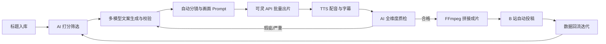

# B 站 AI 全自动科普视频量产系统

> **目标**：面向 B 站创作激励赛道，以代码驱动全链路生产，质量优先、极少人工干预，稳定产出标准化科普视频并获取平台激励。  
> **核心原则**：质量优先 · 全自动执行 · 关键链路用好模型、非关键走低价 API · 异常自动重试  
> **首月**：项目先做全链路，**定时任务默认关闭**，后台手动入队约 **15 条**验证效果后再开日批（见 [§13](#13-mvp-试运行手动-15-条)）。  
> **分发**：成片以 **9:16 MP4** 为统一产物；**B 站**为 MVP 首发与激励回流主站；**抖音 / 快手 / 视频号等**同样可走各平台**开放 API 投稿**（需单独注册应用与 OAuth），与 B 站并列于 `publish` 阶段的多适配器（见 [§13.4](#134-多平台分发)）。  
> **项目形态**：**独立新建仓库**实施；不在 MyTodo 项目中开发或部署。本文档与 `选题.md` 为需求规格，代码落地时迁入新仓库 `docs/`。

---

## 目录

1. [项目范围](#1-项目范围)
2. [核心需求](#2-核心需求)
3. [全自动工作流](#3-全自动工作流)
4. [各环节生产规则](#4-各环节生产规则)
5. [AI 自动化质检体系](#5-ai-自动化质检体系)
6. [技术选型](#6-技术选型)
7. [管理后台](#7-管理后台)
8. [各环节 AI 清单](#8-各环节-ai-清单)
9. [成本核算](#9-成本核算)
10. [成本与配额管控](#10-成本与配额管控)
11. [数据迭代](#11-数据迭代)
12. [人工干预边界](#12-人工干预边界)
13. [MVP 试运行（手动 15 条）](#13-mvp-试运行手动-15-条)
14. [成功标准与约束](#14-成功标准与约束)
15. [外部 API 注册清单](#15-外部-api-注册清单)

附录：[平台激励.md](./平台激励.md)（主流平台创作激励对比）

---

## 1. 项目范围

| 维度 | 说明 |
| --- | --- |
| **做什么** | 标题→文案→画面→配音→剪辑→投稿，全自动 |
| **不做什么** | 低质静态素材；日常手动剪辑、改稿、投稿 |
| **人工角色** | 仅抽检成品，不参与制作与修改 |
| **内容边界** | 科普向；禁伪科学、医疗、理财、时政等 |
| **工程边界** | 独立后端 + 独立管理前端 + Worker；与 MyTodo **零代码依赖** |
| **分发边界** | 生产一次、成片多投；**B 站**为激励与 §11 回流主站；其他平台经**各自开放 API** 或手传（见 [§13.4](#134-多平台分发)） |

---

## 2. 核心需求

- **画面底座**：统一使用可灵 AI 动态视频，摒弃剪映静态素材，保障成片观感。
- **全链路无人值守**：从标题入库到 B 站投稿，默认零人工操作。
- **多模型协同**：文案创作、润色、事实校验、标题打分分工明确。
- **全维度 AI 质检**：覆盖文案、画面、音频；不合格自动分级回退重制。
- **合规兜底**：全环节拦截违规、擦边、敏感与事实错误内容。
- **管理后台**：标题、任务、成片、配置、成本与抽检统一可视与操作（见 [§7](#7-管理后台)）。

---

## 3. 全自动工作流



### 阶段说明

| 阶段 | 产出物 |
| --- | --- |
| 标题筛选 | 进入生产队列的优质标题 |
| 文案生产 | 分镜脚本 + 口播稿（含字数与时长约束） |
| 画面生产 | 6–8 段 9:16 动态片段 |
| 音视频 | 配音轨、时间轴字幕、成片 MP4 |
| 投稿 | 已发布稿件及元数据 |
| 回流 | 播放/完播/评论/收益等指标 |

### 各环节 AI 一览（按流水线顺序）

| 步骤 | 环节 | 子任务 | AI / 模型 | 部署 | 计费 |
| --- | --- | --- | --- | --- | --- |
| 1 | 标题入库 | 去重、格式化 | 无（规则引擎） | 本地 | 免费 |
| 2 | 标题筛选 | 合规 / 适配 / 爆款 / 热度 | V4-Flash Non-thinking ×2 | API | 低 |
| 3 | 文案生产 | 科普初稿 | **DeepSeek-V4-Flash**（Non-thinking） | API | 低 |
| 3 | 文案生产 | 事实校验 | **DeepSeek-V4-Flash**（Thinking）+ RAG 知识库 | API | 低 |
| 3 | 文案生产 | 口语润色 | **DeepSeek-V4-Flash**（Non-thinking） | API | 低 |
| 3 | 文案生产 | 分镜拆分 | **DeepSeek-V4-Flash**（Non-thinking） | API | 低 |
| 4 | 画面 Prompt | 6～8 段可灵 Prompt | V4-Flash Non-thinking | API | 低 |
| 5 | 画面生成 | 9:16 动态片段 ×6～8 | **可灵开发者 API**（`kling-v2-5-turbo` pro） | API | **高** |
| 6 | 配音字幕 | 口播 + 句级时间轴 | **CosyVoice**（API，同步返回 SRT） | API | 中低 |
| 7 | 文本质检 | 合规 / 事实 / 可读 | **DeepSeek-V4-Flash**（Thinking 终审） | API | 低 |
| 7 | 画面质检 | 文案-画面对齐 | **Qwen2.5-VL-7B-Instruct**（百炼 / 兼容 API） | API | 低 |
| 7 | 画面质检 | 画质 / 水印 / 黑屏 | YOLOv8n + OpenCV（轻量服务） | 自建 | 可忽略 |
| 7 | 音频质检 | 爆音 / 静音 / 时长 | Silero VAD + 响度规则 | 自建 | 可忽略 |
| 8 | 成片剪辑 | 拼接、转码 | FFmpeg（非 AI） | 自建 | 可忽略 |
| 9 | 投稿 | 上传、填元数据 | B 站开放接口（非 AI） | — | 免费 |
| 10 | 数据回流 | 策略归因 | 统计脚本 + **V4-Flash** 周报（可选） | API | 低 |

> **分工**：文案与质检主模型 **DeepSeek-V4-Flash**；画面对齐 **Qwen-VL**；现金大头仍为 **可灵**；不按电费/存储计成本。

---

## 4. 各环节生产规则

### 4.1 标题筛选

- 多模型交叉打分，维度：**合规性**、**科普适配度**、**爆款潜力**、**搜索热度**。
- 低于阈值的标题直接淘汰，不进入生产队列（阈值由配置项管理，支持回流数据调参）。

### 4.2 文案生产

| 项 | 标准 |
| --- | --- |
| 字数 | 950–1150 字 |
| 时长 | 适配 4:20–5:20（B 站常见科普时长） |
| 模型分工 | 初稿生成 → 事实校验 → 口语化润色 → 分镜拆分 |
| 硬性规避 | 知识点错误、生硬书面语、不利于 TTS 的断句 |

### 4.3 画面生产

- 调用 **可灵开发者 API**（[dev 定价](https://klingai.com/dev/pricing?scrollTo=video)、[金山云价目](https://docs.ksyun.com/documents/44741)），**9:16** 竖屏。
- 默认：`kling-v2-5-turbo` + `pro` + `duration=5`（10s 见 §9）+ `sound=off`（配音 CosyVoice）。
- 单条拆 **6–8** 段（受 API 单次最长 5/10s 限制）；画风与 Prompt 模板固定。
- 代码层按 **段数 × 单价** 累计月度预算；超额时 **告警 + 暂停任务**。

### 4.4 音视频生产

- **CosyVoice API** 一次调用输出：配音文件 + 句级字幕时间轴（SRT/JSON），口播稿为唯一文本源。
- 音频质检仅做爆音、静音、时长；不跑 ASR。读稿问题在**文本质检或成片抽检**发现后，**回退改文案 → 重新 TTS**。
- 合格片段由 FFmpeg 自动拼接合成，**无人工剪辑环节**。

---

## 5. AI 自动化质检体系

> **定位**：文案 Thinking 质检；画面对齐 Qwen-VL API。

### 5.1 文本质检

| 检测项 | 说明 |
| --- | --- |
| 合规 | 违规、擦边、敏感表述 |
| 事实 | 科普知识点正误，杜绝伪科学 |
| 可读性 | 口语化程度、字数区间、语句流畅度 |

### 5.2 画面多模态质检

| 检测项 | 说明 |
| --- | --- |
| 内容对齐 | 画面与文案、Prompt 是否一致，防止跑偏 |
| 画质 | 模糊、黑屏、畸形、色块错乱、水印残留 |
| 合规 | 不适宜或违规画面 |

### 5.3 音频质检

- 爆音、静音、断音（规则检测）。
- 成片总时长是否落在 **4:20–5:20** 标准区间。
- 口播内容与断句问题归属**文本质检**；音频轨不合格时回退 **文案 → TTS**，不单独走 ASR。

### 5.4 质检分级与处置

| 级别 | 条件（示例） | 处置 |
| --- | --- | --- |
| **一级 · 合格** | 各维度通过 | 拼接成片 → 投稿队列 |
| **二级 · 瑕疵** | 局部片段异常 | 仅重制异常片段，保留文案与其余画面 |
| **三级 · 严重** | 文案或画面大面积不可用 | 回退至上游阶段（文案或全链路）重制 |

```text
质检结果 → 一级：投稿队列
         → 二级：标记异常 segment_id → 仅重跑画面/音频任务
         → 三级：标记 fail_stage → 从文案或标题阶段重新调度
```

---

## 6. 技术选型

**独立仓库**（建议 monorepo），技术栈与 MyTodo 类似但**单独依赖、单独部署**。

### 6.0 仓库结构（规划）

```text
bilibili-video-factory/          # 新建项目根目录（名称可改）
├── backend/                   # Python：API + Worker
│   ├── main.py
│   ├── app/api/               # REST
│   ├── app/services/          # 外部 API 封装
│   ├── app/qc/
│   ├── app/models/            # SQLite
│   └── worker/                # video_worker 进程
├── frontend/                  # Vue3 管理后台
├── docs/
│   ├── 需求.md
│   └── 选题.md
├── data/                      # SQLite、成片产物（.gitignore）
├── requirements.txt
└── docker-compose.yml         # 可选：Redis + 后端 + Worker
```

### 6.1 系统组件清单

| 层级 | 组件 | 说明 | 用途 |
| --- | --- | --- | --- |
| **运行时** | Python 3.10+ | 独立 venv/conda | 后端与 Worker |
| **Web 服务** | Flask | `backend/main.py` | 管理后台 API |
| **API 规范** | flask-smorest 或 Flask-RESTX | 新建 | OpenAPI 文档 |
| **数据库** | SQLite | 新建库文件 | 任务、标题、文案、片段、配置 |
| **缓存** | Redis | 独立实例 | 可灵配额、锁、暂停开关 |
| **定时** | APScheduler（可选） | 默认**关闭**，见 [§13](#13-mvp-试运行手动-15-条) | 稳定后：日批打分、数据回流 |
| **任务 Worker** | 独立进程 | `python -m worker` | 按 `stage` 执行流水线 |
| **并行** | ThreadPoolExecutor | 标准库 | 可灵 2～3 段并行 |
| **媒体处理** | FFmpeg | 部署机安装 | 拼接、烧字幕、转码 |
| **视觉规则** | OpenCV + YOLOv8n | pip | 画质检测 |
| **音频规则** | Silero VAD + 响度检测 | pip | 爆音、静音、时长 |
| **LLM** | DeepSeek V4-Flash API | 环境变量密钥 | 文案、打分、质检 |
| **多模态** | Qwen2.5-VL-7B API | 百炼等 | 画面对齐 |
| **画面生成** | 可灵开发者 API | `KLING_API_KEY` | 按段计费，见 §9 |
| **配音字幕** | CosyVoice API | 硅基流动/阿里 | 音频 + 句级时间轴 |
| **Embedding** | bge-m3 | API 或本地 | RAG 知识库 |
| **投稿** | B 站开放接口 | — | 上传与元数据 |
| **产物存储** | `data/media/` 或 OSS | 配置项 | 片段、音轨、成片 |
| **管理端** | Vue3 + Element Plus | `frontend/` | 见 [§7](#7-管理后台) |
| **鉴权** | JWT（自建用户表或单用户 Token） | 新建 | 后台登录 |

### 6.2 任务编排（轻量 Worker）

月产 **10～20 条**，采用 **SQLite 任务表 + 单 Worker 状态机**，不使用 Celery。

| 表/字段（示意） | 说明 |
| --- | --- |
| `video_job` | 一条成片任务：`stage`、`status`、`fail_stage`、`retry_count` |
| `video_segment` | 可灵片段：`segment_id`、`kling_status`、文件路径 |
| `stage` 枚举 | title→script→kling→tts→qc→ffmpeg→**publish**（内嵌多平台适配器）→done |

| 机制 | 实现 |
| --- | --- |
| 投递 | 管理后台或 API `POST /video/jobs` 插入 `pending` |
| 执行 | `video_worker.py` 循环取 `pending`/`running`（**不依赖**定时任务；MVP 仅手动入队） |
| 可灵并行 | 同 job 内 `ThreadPoolExecutor(max_workers=3)` 跑多段 |
| 二级重制 | 指定 `segment_id` 置 `pending`，Worker 只跑 `kling` 相关 |
| 三级回退 | 写 `fail_stage=script`，从该 stage 往后重跑 |
| 配额 | Redis `INCR kling:month:YYYYMM`，超限置全局 `paused` |
| 定时（可选） | `ENABLE_SCHEDULER=true` 时：标题批打分、B 站数据拉取；**默认 false** |

Flask **不执行**长耗时步骤；Worker 单独进程启动，与 API 可同机或分机部署。

**首月建议**：只启 API + Worker，**不启** APScheduler；标题打分、创建 15 条 job、拉播放数据均在管理后台或 CLI **手动触发**（见 [§13](#13-mvp-试运行手动-15-条)）。

### 6.3 后端模块划分

| 路径 | 职责 |
| --- | --- |
| `backend/worker/` | 状态机、各 stage 执行器 |
| `backend/app/services/` | DeepSeek、可灵、CosyVoice；`publish/`：B 站、抖音、快手等 |
| `backend/app/qc/` | 文/画/音质检 |
| `backend/app/api/` | 管理后台 REST |
| `backend/app/models/` | SQLite 表与迁移 |

### 6.4 模型模式与路由（LLM / 多模态）

| 场景 | API 模型 ID | 模式 |
| --- | --- | --- |
| 标题打分、润色、分镜、Prompt | `deepseek-v4-flash` | Non-thinking（低延迟低价） |
| 初稿、事实校验、文本质检终审 | `deepseek-v4-flash` | Thinking（质量优先） |
| 单段画面是否跑偏 | `qwen2.5-vl-7b-instruct` 等 | 多模态单帧/多帧 |
| 疑难事实（校验打回） | 可选 `deepseek-v4-pro` | 仅失败重试时触发 |

RAG：embedding 用 **bge-m3**（API 或本地均可，成本极低）；知识库为科普事实片段。

---

## 7. 管理后台

流水线全自动，但**配置、监控、抽检、手动重试**由**本项目自带管理后台**完成（`frontend/`，独立部署）。

### 7.1 功能模块

| 模块 | 功能 |
| --- | --- |
| **标题库** | 批量导入（对接 `选题.md` 规则）、列表、AI 打分结果、筛选入队 |
| **生产队列** | `video_job` 列表：阶段、状态、耗时、错误信息；筛选 pending/running/failed |
| **任务详情** | 口播稿、分镜、每段 Prompt/可灵状态、配音预览、质检报告、成片预览、**成片下载**（供多平台手传） |
| **人工操作** | 暂停/恢复队列；对 job 触发「从某 stage 重跑」；二级指定片段重制 |
| **抽检** | 成片标记通过/打回；打回时选择回退 stage（文案/画面） |
| **配置中心** | Prompt 模板、打分阈值、画风、可灵参数、API 开关（读环境变量） |
| **成本与数据** | 月 API/可灵用量、单条成本、播放/收益回流图表（§9、§11） |
| **日志** | 按 job 查看 stage 日志与外部 API 报错栈 |

### 7.2 接口与页面

| 端 | 路径（规划） |
| --- | --- |
| 前端 | 独立站点，如 `http://localhost:5174`（Vite 默认另端口） |
| 页面 | 标题库 / 生产队列 / 配置 / 数据（多 Tab 单页应用） |
| 后端 API | `http://localhost:8xxx/api/v1/*` |
| Worker | 无 HTTP；读 SQLite，写日志表 |

### 7.3 权限

- 自建简单账号或单用户 `ADMIN_TOKEN`（MVP 可仅 Bearer 校验）。
- 写操作：暂停队列、重跑 stage、改配置、抽检打回。

---

## 8. 各环节 AI 清单

与 [§3 各环节 AI 一览](#各环节-ai-一览按流水线顺序) 相同，本节按**成本视角**汇总调用次数（单条成片、一次通过、7 片段基准）。

| 环节 | 模型 | 单次成片约用量 | 备注 |
| --- | --- | --- | --- |
| 标题筛选 | V4-Flash ×2 | ~6k in / ~1.5k out | Non-thinking |
| 文案链路 | V4-Flash ×4 | ~20k in / ~10k out | 校验/质检用 Thinking |
| 画面 Prompt | V4-Flash ×1 | ~3k in / ~2k out | — |
| 画面生成 | 可灵 API | **7 次视频** | 现金主项 |
| 配音字幕 | CosyVoice API | ~1100 字 + 时间轴 | 单次调用 |
| 文本质检 | V4-Flash Thinking ×1 | ~5k in / ~2k out | 合并三轮为一次终审 |
| 画面质检 | Qwen-VL ×7 帧 | 7 次多模态 | 可对可疑帧二检 |
| 音频质检 | 规则检测 | 1 条音轨 | 无 ASR |
| 回流 | V4-Flash（可选） | 日批 | 可忽略单条摊销 |

重制系数：二级 +1～3 可灵段 +1～2 VL；三级 +全文案 LLM +7 可灵。API 预算按 **1.3 倍** Token、**1.25 倍** 可灵预留。

---

## 9. 成本核算

> **口径**：只计可灵开发者 API + 按量 API；不计电费/存储/带宽/硬件。
> 汇率 1 USD≈7.2 CNY；DeepSeek 见 [官方定价](https://api-docs.deepseek.com/)。

### 9.0 可灵计费说明（自动化必读）

| 项目 | 说明 |
| --- | --- |
| **计费对象** | 全自动流水线走 **开发者 API 按段扣费**，不是 App 内「黄金会员 66 元/月」灵感值 |
| **66 元会员** | C 端约 660 灵感值，适合**人手试 Prompt**；与 API 钱包/资源包**不互通**，勿写入月预算 |
| **默认模型** | turbo + pro + 5s + 9:16 + 无声 |
| **官方单价** | turbo **std 1.5 元/5s**、**pro 2.5 元/5s**（[金山云视频模型价](https://docs.ksyun.com/documents/44741)，2026-06） |
| **10 秒片段** | 按量平台通常按 **2×5s** 计；下文按 **5s 单价 ×2** 估算 10s |
| **单条基准** | 一次通过、**7 段/条**；重制按 §8 预留 **×1.25** 段数 |

### 9.1 成本结构总览（月产 15 条、一次通过率 75%、含 1.25× 可灵重制）

| 成本项 | 计费方式 | 月金额（估） | 占比 |
| --- | --- | --- | --- |
| 可灵 API（**pro** 5s×7 段×15 条×1.25） | 2.5 元/段 | **~328 元** | **~95%** |
| 可灵 API（**std** 同上，MVP 试跑） | 1.5 元/段 | **~197 元** | ~93% |
| DeepSeek V4-Flash | 按 Token | **3～8 元** | ~2% |
| Qwen2.5-VL-7B | 按次/Token | **1～3 元** | ~1% |
| CosyVoice TTS API | 按字数 | **5～12 元** | ~3% |
| YOLO / FFmpeg | 自建 | **0** | — |

**月现金合计（质量优先 · pro）**：约 **337～351 元**（中性 **~343 元**）。
**MVP 试跑（std，画质降档）**：约 **206～220 元**（中性 **~212 元**）。

### 9.2 API 单价与单条 Token 测算

#### DeepSeek V4-Flash（官方 preview 价）

| 方向 | 单价（USD/1M） | 约合（CNY/1M） |
| --- | --- | --- |
| 输入（cache miss） | $0.14 | ~1.0 元 |
| 输出 | $0.28 | ~2.0 元 |

单条成片（7 段、一次通过）LLM 约 **35k input + 15k output**：

```text
LLM 费 ≈ 0.035×1.0 + 0.015×2.0 ≈ 0.065 元/条（约 6 分人民币）
```

含 Thinking 模式与 1.3 倍重试缓冲：**~0.08～0.12 元/条**。

#### 其他 API（国内平台中性价，可替换供应商）

| 服务 | 单条用量 | 单条成本（估） |
| --- | --- | --- |
| Qwen-VL 画面对齐 | 7 帧 | **0.05～0.15 元** |
| CosyVoice 配音+字幕 | ~1100 字 | **0.3～0.8 元** |

**单条 API 合计（不含可灵）**：约 **0.45～1.05 元**。

### 9.3 单条视频全成本

基准：7 段/条，可灵含 **1.25×** 重制系数；其他 API **~0.65 元/条**（与产量无关）。

| 档位 | 可灵（7 段×单价×1.25） | + API | **单条合计** |
| --- | --- | --- | --- |
| **pro** 5s | 7×2.5×1.25 ≈ **21.9 元** | ~0.65 元 | **~22.5 元** |
| **std** 5s | 7×1.5×1.25 ≈ **13.1 元** | ~0.65 元 | **~13.8 元** |

#### 可灵段数与月预算（pro 2.5 元/段）

| 月产量 | 段数（×7×1.25） | 可灵月费 | 含其他 API 月合计（估） |
| --- | --- | --- | --- |
| 10 条 | 88 段 | **~220 元** | **~232 元** |
| 15 条 | 131 段 | **~328 元** | **~343 元** |
| 20 条 | 175 段 | **~438 元** | **~453 元** |

若改 **5 段/条 + 10s**：pro 约 **5 元/段**（2×5s 计价），5×5×1.25≈**31.3 元/条**，通常**不比 7×2.5 省**。

### 9.4 月度损益（创作激励）

本节回答两件事：**一个月要掏多少现金**；**全账号播放要达到多少，激励收入才盖住这些现金**（未计人工、税费）。

#### 怎么算「盈亏平衡播放」

B 站创作激励按播放量折算，此处用 `选题.md` 中性值：**每 1000 次播放 ≈ 2.3 元**（千播 2.3 元）。

```text
月总播放（次） ≈ 月现金成本（元） ÷ 2.3 × 1000
```

例：中性 **pro** 月现金 **~343 元** → 343 ÷ 2.3 × 1000 ≈ **14.9 万次/月**（全账号播放加总）。

#### 情景表（默认可灵 **pro**；括号内为 **std** MVP）

| 情景 | 月产量 | 月现金成本 | 单条成本 | 盈亏平衡（月总播放） |
| --- | --- | --- | --- | --- |
| 保守 | 10 条 | **~232 元**（~142） | **~23 元**（~14） | **~10.1 万**（~6.2 万） |
| 中性 | 15 条 | **~343 元**（~212） | **~23 元**（~14） | **~14.9 万**（~9.2 万） |
| 乐观 | 20 条 | **~453 元**（~282） | **~23 元**（~14） | **~19.7 万**（~12.3 万） |

- **月现金**：可灵按段数线性增长（见 §9.3）；DeepSeek/Qwen-VL/CosyVoice 随产量略增，占比 **<5%**。
- **单条成本**：pro 下可灵占 **~95%**，增产**不能**显著拉低单条价（除非减段数或改 std）。
- **盈亏平衡**：15 条**合计**达到上表播放即可打平；非单条 3.5 万播。

#### 单条播放够不够回本？

中性 **pro** 单条约 **22.5 元**。若某条播放 **3000 次**：

```text
该条激励收入 ≈ 3000 ÷ 1000 × 2.3 ≈ 6.9 元  <  22.5 元
```

约需 **22.5 ÷ 2.3 × 1000 ≈ 9800 次播放**，该条收入才接近覆盖制作成本；账号打平仍看 §9.4 情景表**月总播放**。

升级 **V4-Pro** 仅在三级回退终审时触发，月增 **< 10 元**，对上表影响很小。

### 9.5 重制与失败成本

| 质检结果 | 额外 API | 额外可灵（pro 5s） |
| --- | --- | --- |
| 一级通过 | 0 | 0 |
| 二级（重 2 段） | VL ×2，+~0.1 元 | **+5 元**（2×2.5） |
| 三级（文案重做） | LLM 全流程 +~0.15 元 | **+17.5 元**（7×2.5） |

质量优先策略：**宁可多跑 Thinking 与 VL 二检**，也不要为省 **< 0.2 元/条** API 牺牲通过率（可灵重 1 段 ≈ **2.5 元**）。

### 9.6 降本开关（质量不降档前提下）

| 开关 | 节省 | 代价 |
| --- | --- | --- |
| 标题打分改 Non-thinking 单次 | ~0.01 元/条 | 略降筛选精度 |
| 文本质检合并为 1 次 Thinking | ~0.02 元/条 | 需写好合并 Prompt |
| TTS 改更低价供应商 | ~0.2 元/条 | 需试听对比音色 |
| 可灵改 **std**（1.5 元/5s） | 月费约 **-40%** | 质感降档；**MVP 验证播放时可开** |
| 减少段数（6 段/条） | 可灵约 **-14%** | 需改分镜与剪辑逻辑 |

---

## 10. 成本与配额管控

| 类型 | 金额 / 策略 |
| --- | --- |
| **主成本** | 可灵 API 按段（pro 默认 **~22.5 元/条**）；月 15 条预算 **~330～350 元** |
| **可变成本** | DeepSeek + Qwen-VL + CosyVoice，约 0.45～1.05 元/条 |
| **配额管控** | Redis 段数×单价；超 `KLING_MONTHLY_BUDGET_CNY` 暂停；DeepSeek cap **15 元/月** |
| **成本仪表盘** | 管理后台展示：可灵段数、Token/字数、重制级别、播放收益 |

---

## 11. 数据迭代

自动抓取已发布稿件的 **播放、完播、评论、收益** 等指标，回流至系统后用于：

- 优化标题打分权重与淘汰阈值；
- 优化文案 Prompt 与口播风格；
- 优化画面 Prompt 模板与分镜策略。

目标：**产量稳定的前提下，随数据积累提升通过率与爆款率**。

---

## 12. 人工干预边界

| 允许（管理后台） | 不允许 |
| --- | --- |
| 抽检成片、打回并指定回退 stage | 手动剪辑、补画面 |
| 改 Prompt/阈值、暂停队列、触发重跑 | 制作中手动剪辑、**绕过质检**的投稿 |
| 下载/导出成片，分发至抖音、快手、视频号等 | 在后台直接改口播稿（应打回走文案 stage） |
| 查看成本与播放数据（B 站为主；其他平台可手填或后续对接） | — |

---

## 13. MVP 试运行（手动 15 条）

> **原则**：先跑通流水线、**不开定时**；可灵 API **手动 15 条**（§9，可灵约 **260～330 元**）看数据后再日批。

### 13.1 启动方式（默认）

| 进程 | 是否启动 | 说明 |
| --- | --- | --- |
| Flask API + 管理后台 | ✅ | 配置、标题库、入队、监控 |
| `python -m worker` | ✅ | 消费队列中的 `video_job`，按 stage 推进 |
| APScheduler | ❌ | `.env` 中 `ENABLE_SCHEDULER=false`（默认） |

定时相关能力（标题批打分、B 站数据日拉）**代码保留**，仅通过环境变量或配置中心开关；MVP 阶段全部改为**手动一次触发**。

### 13.2 手动跑 15 条流程

1. **准备标题**：按 `选题.md` 导入约 20～30 条候选（留淘汰余量）。
2. **打分入队**：后台勾选标题 →「AI 打分」→ 达标者「创建成片任务」；或 `POST /video/jobs` 批量创建，累计 **15 条** `pending`。
3. **启动 Worker**：单进程循环处理，无需 cron；队列暂停开关保持 **运行**。
4. **观察**：管理后台看阶段、可灵段数、质检报告、成片预览；异常用「从某 stage 重跑」，不手改稿。
5. **B 站投稿**：Worker 自动 `publish`；手动点「拉取播放/收益」，对照 §9.4 盈亏平衡。
6. **其他平台（可选）**：MVP 可下载 MP4 手传；二期可对已开通开放平台账号走 **API 同发**（见 [§13.4](#134-多平台分发)），不重复制作。
7. **再开定时**：15 条效果满意后，设 `ENABLE_SCHEDULER=true`，切日常无人值守。

### 13.3 与全自动目标的关系

| 项 | MVP（首月） | 稳定运营 |
| --- | --- | --- |
| 任务投递 | 后台/API **手动**创建 job | 定时批打分 + 自动入队（可选） |
| 数据回流 | **手动**拉一次或按需拉 | APScheduler 日批 |
| 验收重点 | 15 条成片质量、千播、通过率 | 月产稳定、少告警 |

全自动仍是终态；**不要求**首月零点击跑满 15 条，只要求链路可重复、成本可控。

### 13.4 多平台分发

流水线在 `ffmpeg` 阶段产出**终态成片**（9:16、4:20–5:20、带字幕），此后分发与生产解耦。`publish` 阶段设计为**多适配器**：同一 MP4 依次（或并行）调用各平台 API，失败仅重试该平台，不回到可灵。

#### 能否 API 投稿？

**可以。** 主流短视频平台均有开放平台上传/发布接口，但需**逐平台**注册应用、申请权限（如抖音 `video.create`）、完成创作者 **OAuth 授权**，与 B 站一样不是「一个 Key 通吃」。

| 平台 | 开放投稿 API（概况） | 典型门槛 | MVP 建议 |
| --- | --- | --- | --- |
| **B 站** | 开放平台上传 + 元数据 | 创作者号、应用审核 | **必接**，Worker 默认自动发 |
| **抖音** | 上传得 `video_id` → `create_video` 发布；大文件分片上传 | 开发者应用、用户授权、`代替用户发布` 等能力申请 | 二期 `DouyinPublishAdapter` |
| **快手** | 开放平台视频发布类接口 | 应用审核、账号绑定 | 二期，与抖音类似 |
| **微信视频号** | _channels 相关开放能力（以当期文档为准） | 主体资质、接口范围较窄 | 二期或手传兜底 |
| **小红书** | 部分能力开放，发布类常需商务/类目资质 | 门槛偏高 | 优先手传或后期再接 |

实施时以**当期官方文档**为准；代码放在 `backend/app/services/publish/`（如 `bili.py`、`douyin.py`）。

#### 工程形态（规划）

```text
stage=publish
  ├─ publish_bili      # 必开，写 bvid、触发 B 站回流
  ├─ publish_douyin    # DOUYIN_PUBLISH_ENABLED
  ├─ publish_kuaishou  # KUAISHOU_PUBLISH_ENABLED
  └─ …                 # 未启用或失败 → skipped，可后台重试或改手传
```

| 阶段 | B 站 | 其他平台 |
| --- | --- | --- |
| **MVP（手动 15 条）** | API 自动投稿 + 手动拉数据 | **默认关闭** API；可下载 MP4 **手传**先验证 |
| **二期** | 不变 | 接 1～2 个平台 API，同一 job 内顺序发布 |
| **稳定运营** | 定时回流 | 多平台 API + 能接的数据统计 |

#### 接 API 时注意

- **授权**：每平台独立 token，发布前检查过期并刷新。
- **规格**：单文件大小、分片、竖版分辨率各平台不同；4～5 分钟成片需确认是否分片上传。
- **元数据**：标题、话题、封面策略需**分平台映射**，不宜与 B 站完全共用。
- **审核**：API 发布后仍走平台审核；发布失败记入 `publish_*` 日志，不判为成片质检失败。

#### 说明

- **赚钱与调参仍以 B 站为主**；其他平台 API 是增量曝光，**不重复跑可灵**。
- **手传是 MVP 省事选项**，不是技术上限；验证 15 条后再接抖音/快手 API 更稳。
- 某平台无回流 API 时数据可手填，**不替代** B 站驱动 §11 调参。
- 各平台激励名称、千播参考、准入与 MVP 优先级见 **[平台激励.md](./平台激励.md)**。

---

## 14. 成功标准与约束

### 14.1 成功标准（验收参考）

#### MVP（手动 15 条）

- [ ] `ENABLE_SCHEDULER=false` 时，API + Worker 可完成单条 title→publish 全链路。
- [ ] 管理后台可手动：导入标题、打分、创建 job、看重跑/抽检、拉播放数据。
- [ ] 手动投递 **15 条** 后，可统计单条成本、月总播放与 §9.4 盈亏对比。

#### 稳定运营（定时开启后）

- [ ] 单条视频从标题入库到投稿 **无需人工点击**即可完成（除配置与告警处理）。
- [ ] 质检三级逻辑可复现：二级仅重制片段，三级可回退指定阶段。
- [ ] 成片时长稳定在 **4:20–5:20**，字数 **950–1150**。
- [ ] 可灵配额触顶时任务 **自动暂停** 且可观测（日志/告警）。
- [ ] 违规与伪科学样本能被文本质检拦截。
- [ ] 管理后台可完成：标题入队、队列监控、详情预览、按 stage 重跑、抽检打回。

### 14.2 风险与约束

- **外部依赖**：可灵 API 可用性与月度配额为产能上限瓶颈。
- **API 依赖**：DeepSeek / 阿里等可用性；密钥轮换与超时重试必做。
- **产能**：瓶颈在可灵月度额度；可灵任务可 2～3 路并行。
- **工程**：独立仓库单独运维；与 MyTodo 仅文档级参考，不共享数据库与部署。
- **平台规则**：B 站投稿接口、内容规范变更需可配置、可快速停用某类题材。
- **版权**：可灵商用授权范围以平台当前条款为准，文档与配置需可更新。

---

## 15. 外部 API 注册清单

实施前需逐项注册并写入 `.env`（勿提交仓库）。下表为**当前方案**所需；供应商二选一处在备注说明。

### 15.1 必注册（上线最小集）

| # | 平台 | 用途 | 环节 | 环境变量 |
| --- | --- | --- | --- | --- |
| 1 | **DeepSeek** | 文案、打分、质检 | 2～4、7、10 | `DEEPSEEK_API_KEY` |
| 2 | **可灵 Kling** | 动态画面 | 5 | `KLING_API_KEY` |
| 3 | **CosyVoice** | 配音+字幕轴 | 6 | `TTS_API_KEY` 等 |
| 4 | **百炼 Qwen-VL** | 画面对齐 | 7 | `DASHSCOPE_API_KEY` |
| 5 | **B 站开放平台** | 投稿 | 9 | `BILI_CLIENT_*` |
| 6 | **B 站创作者号** | 发布主体 | 全流程 | `BILI_ACCESS_TOKEN` |

注册入口：

- #1 [DeepSeek](https://platform.deepseek.com)
- #2 [可灵开发者](https://klingai.com/dev)（API Key + 资源包/按量；国内可用 [金山云星流](https://docs.ksyun.com/documents/44983)）
- #3 CosyVoice：§15.2
- #4 [阿里云百炼](https://bailian.console.aliyun.com)
- #5 [B 站开放平台](https://open.bilibili.com)
- #6 B 站实名创作者账号

`deepseek-v4-pro` 与 #1 同 Key，无需另注册。

### 15.2 CosyVoice 供应商（二选一）

| 供应商 | 说明 | 注册入口 |
| --- | --- | --- |
| **阿里云百炼** | 与 #4 共用 `DASHSCOPE_API_KEY` 时可只注册百炼一家 | 百炼 → 语音合成 / CosyVoice 模型 |
| **硅基流动** | 独立 Key；模型路由填写 CosyVoice 相关模型 | [siliconflow.cn](https://siliconflow.cn) |

选型时确认接口**返回句级时间戳（SRT/JSON）**，见 §4.4。

### 15.3 建议注册（RAG 事实库）

| # | 平台 | 用途 | 是否必注 | 注册入口 | 环境变量 |
| --- | --- | --- | --- | --- | --- |
| 7 | **bge-m3** | RAG 向量 | 可选 | 百炼/硅基或本地 | `EMBEDDING_API_KEY` |

### 15.4 数据回流（与 #5/#6 重叠）

| 能力 | 说明 | 依赖 |
| --- | --- | --- |
| 播放/收益等 | §11 回流 | B 站开放接口 + `bvid` |
| 可选周报归因 | V4-Flash 生成文字报告 | 仅 `DEEPSEEK_API_KEY` |

具体数据接口以开放平台当前文档为准，申请应用时勾选「数据统计」相关 scope。

### 15.5 不需注册的外部服务

| 类型 | 组件 | 说明 |
| --- | --- | --- |
| 本地推理 | OpenCV、YOLOv8n、Silero VAD | pip 安装，无账号 |
| 本地工具 | FFmpeg | 系统安装 |
| 自建 | Redis、SQLite、Flask 管理 API | 自行部署，非第三方 SaaS |

### 15.6 `.env` 模板（示意）

```bash
# LLM
DEEPSEEK_API_KEY=
# 可选三级回退
# DEEPSEEK_PRO_MODEL=deepseek-v4-pro

# 画面（开发者 API，见 §9.0）
KLING_API_KEY=
KLING_MODEL_NAME=kling-v2-5-turbo
KLING_MODE=pro
KLING_DURATION=5
KLING_MONTHLY_BUDGET_CNY=350

# TTS（按供应商填 base_url）
TTS_API_KEY=
TTS_BASE_URL=

# 多模态质检 + 可选 Embedding
DASHSCOPE_API_KEY=

# B 站
BILI_CLIENT_ID=
BILI_CLIENT_SECRET=
BILI_ACCESS_TOKEN=
BILI_REFRESH_TOKEN=

# 全局
VIDEO_DATA_DIR=./data/media
REDIS_URL=redis://localhost:6379/0

# 定时任务（MVP 保持 false，见 §13）
ENABLE_SCHEDULER=false
```

### 15.7 注册顺序建议

1. DeepSeek（可先跑通文案链路）  
2. 可灵（决定月产能上限）  
3. 百炼：Qwen-VL + CosyVoice +（可选）bge-m3  
4. B 站开放平台 + 创作者账号（投稿与回流最后联调）

---

## 附录：术语

| 术语 | 含义 |
| --- | --- |
| 分镜 | 将口播稿拆为与画面对齐的段落及 Prompt |
| 回流 | 发布后将表现数据写回，用于策略迭代 |
| V4-Flash | DeepSeek 主力 API；Non-thinking 快路径，Thinking 质检路径 |
| Thinking 模式 | V4-Flash 深度推理，用于事实校验与文本质检终审 |
| 配音字幕一体 | CosyVoice 同步返回音频与句级时间轴，不单独调用 ASR |
